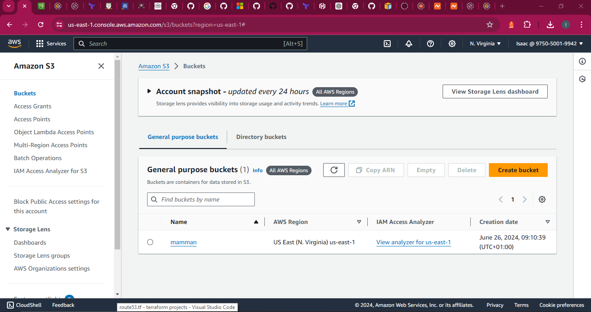
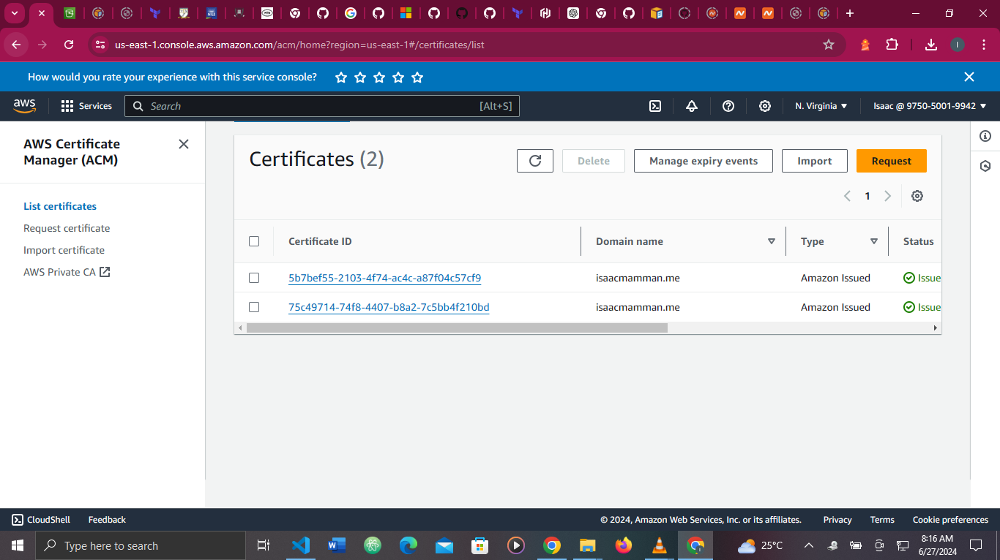
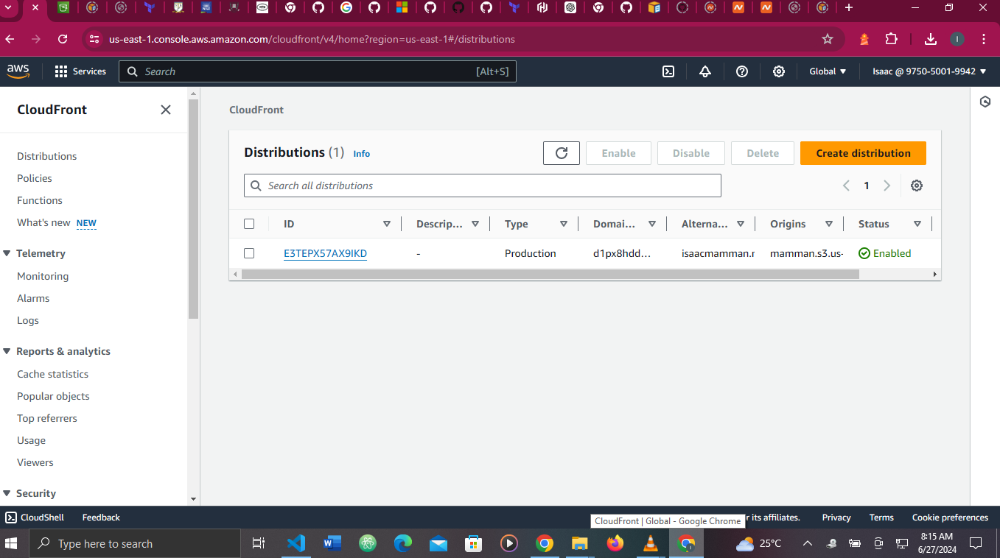
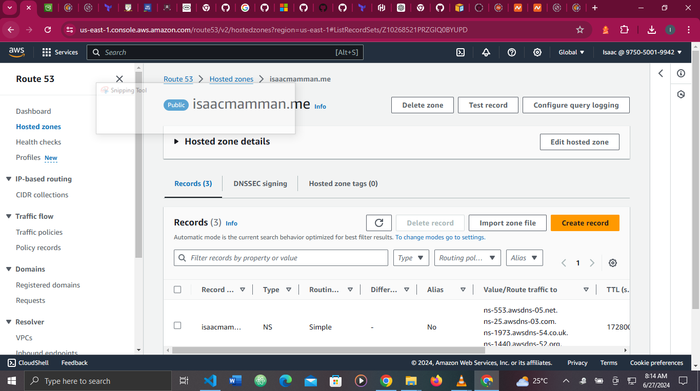

# How to host a static web page using AWS S3, Route53 and CloudFront for content delivery

### Step 1: Create a bucket on AWS S3  
~~~
resource "aws_s3_bucket" "website_bucket" {
    bucket = var.bucket
}
~~~
### Step 2: configure s3 bucket making index.html and error.html be the default document and errror document respectively  
~~~
resource "aws_s3_bucket_website_configuration" "site_bucket_config" {
  bucket = aws_s3_bucket.website_bucket.bucket

  index_document {
    suffix = var.default_document
  }
  error_document {
    key = var.error_document
  }
  
}
~~~
### Step 3: Write the IAM policy document for cloudfront  
~~~
data "aws_iam_policy_document" "cloudfront_policy_document"{
    statement {
      principals {
        identifiers = ["cloudfront.amazonaws.com"]
        type = "Service"
      }
      actions = ["s3:GetObject"]
      effect = "Allow"
      resources = [
        "${aws_s3_bucket.website_bucket.arn}/*"
      ]
    }
}

resource "aws_s3_bucket_policy" "site_bucket_policy" {
    bucket = aws_s3_bucket.website_bucket.id
    policy = data.aws_iam_policy_document.cloudfront_policy_document.json
  
}

~~~

### Step 4: Create Route53 resource  
~~~
resource "aws_route53_zone" "main_hosted_zone" {
    name = var.domain
  
}
~~~
### Step 5: Create a route53 record for acm validation  
~~~
resource "aws_route53_record" "certificate_validation" {
    for_each = {
    for dvo in aws_acm_certificate.domain_cert.domain_validation_options : dvo.domain_name => {
      name   = dvo.resource_record_name
      record = dvo.resource_record_value
      type   = dvo.resource_record_type
    }
  }

  zone_id         = aws_route53_zone.main_hosted_zone.zone_id
  type            = each.value.type
  name            = each.value.name
  records         = [each.value.record]
  ttl             = 60
  allow_overwrite = true
  
}
~~~
### Step 6: Create a route53 record
~~~
resource "aws_route53_record" "main_hosted_record" {
    name = var.domain
    zone_id = aws_route53_zone.main_hosted_zone.id 
    type = "A"

    alias {
      evaluate_target_health = false
      name = aws_cloudfront_distribution.site_distribution.domain_name
      zone_id = aws_cloudfront_distribution.site_distribution.hosted_zone_id
    }
}
~~~

### Step 7: Create and configure a cloudfront distribution referencing domain name, acm certificate and bucket  
~~~
resource "aws_cloudfront_distribution" "site_distribution" {
  enabled = true
  aliases = [var.domain]
  default_root_object = var.default_document
  is_ipv6_enabled = true
  wait_for_deployment = true

  origin {
    domain_name = aws_s3_bucket.website_bucket.bucket_regional_domain_name
    origin_access_control_id = aws_cloudfront_origin_access_control.main.id
    origin_id = aws_s3_bucket.website_bucket.bucket
  }
  restrictions {
    geo_restriction {
      restriction_type = "none"
      locations = []
    }
    
  }
  

  default_cache_behavior {
    allowed_methods = ["GET","HEAD","OPTIONS" ]
    cached_methods = ["GET","HEAD","OPTIONS"]
    cache_policy_id = "2e54312d-136d-493c-8eb9-b001f22f67d2"
    target_origin_id = aws_s3_bucket.website_bucket.bucket
    viewer_protocol_policy = "redirect-to-https"
  }
  viewer_certificate {
    acm_certificate_arn = aws_acm_certificate.domain_cert.arn
    ssl_support_method = "sni-only"
    minimum_protocol_version = "TLSv1.2_2021"
    
  }

}
~~~

### Step 8: Configure cloudfront origin access identity  
~~~
resource "aws_cloudfront_origin_access_control" "main" {
    name = "s3-cloudfront-oac-test"
    origin_access_control_origin_type = "s3"
    signing_behavior = "always"
    signing_protocol = "sigv4"
  
}
~~~
### Step 9: Create ACM certificate 
~~~
resource "aws_acm_certificate" "domain_cert" {
    domain_name = var.domain
    validation_method = "DNS"
    provider = aws.us-east-1

    lifecycle {
      create_before_destroy = true
    }
  
}
~~~
Output    
   
Bucket  

  
Certificate  

  
Cloudfront   

 
Route53

